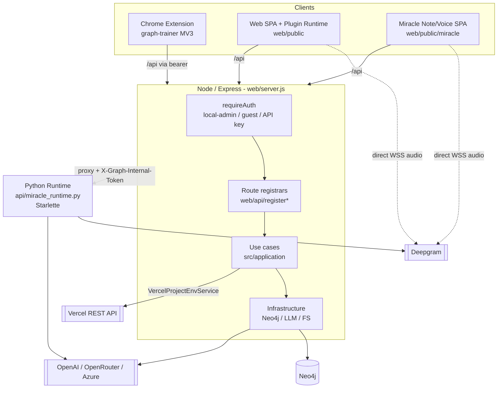
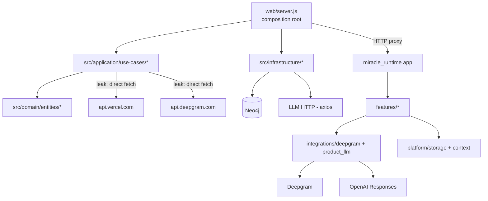
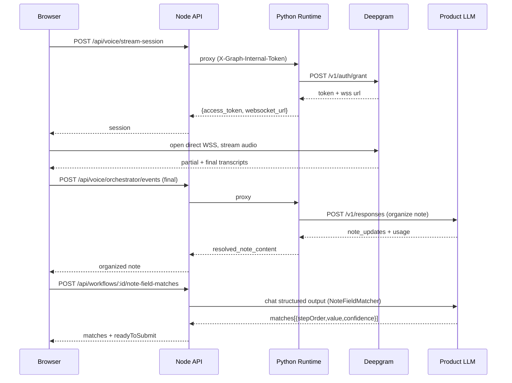
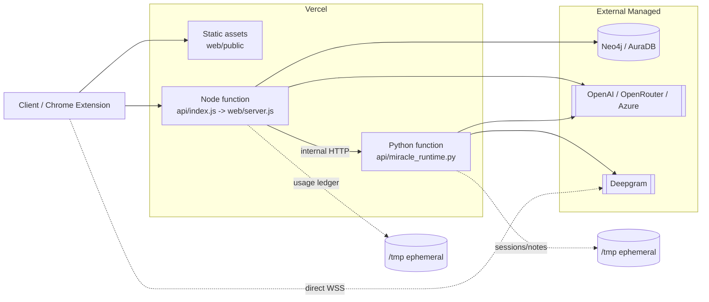
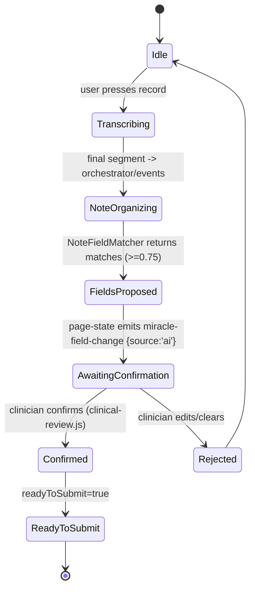

# Architecture & Infrastructure Analysis — Graph (branch `main`)

> Scope: this analysis covers **only the `main` branch** (`origin/main`, HEAD `5c96310 Expose public autofill workflow API`).
> Every claim cites a concrete file path. `Confirmed in <file>` = read directly; `Inferred from usage in <file>` = deduced from callers/config.
> No `.env` or secrets file was read; environment variables are documented by **name and purpose only**, values marked `[not analyzed — sensitive]`.

---

# System Overview

Graph is a **workflow-learning and replay engine for web applications**, currently validated through a clinical (medical EMR) surface. It closes a loop: it watches a user interact with a page, records the interactions as structured `Workflow` + `Step` graphs (persisted in Neo4j), regenerates a discovery catalog, and later lets an LLM-driven assistant select and replay the right workflow — filling missing values — on the current page (`README.md:19-29`, Confirmed). Layered on top is a **clinical dictation pipeline**: browser-direct Deepgram speech-to-text → LLM note organization → autofill of the learned EMR fields (`ARQUITECTURA_Y_PLAN.md:25-33`, Confirmed).

The repository is a **hybrid Node + Python monorepo** deployed as sibling Vercel functions:

- **Node/Express** is the API trunk: auth, rate-limiting, CORS, workflow learning/replay, Neo4j persistence, LLM autofill/matching, provider administration, and a reverse proxy to the Python runtime (`web/server.js`, Confirmed).
- **Python/Starlette** (`bounded/miracle-ai`, deployed as `api/miracle_runtime.py`) is the voice/note runtime: it mints Deepgram streaming tokens and organizes dictated notes with a product LLM (`api/miracle_runtime.py`, `bounded/miracle-ai/src/miracle_agent/app/web_app.py`, Confirmed).
- **Clients** consume the same API: a shared browser runtime (`web/public/`), a Chrome extension host that injects that runtime into arbitrary pages (`chrome-extension-src/graph-trainer/`), and a note/voice SPA (`web/public/miracle/`).

Two historically distinct products ("Graph" learning engine + "Miracle" clinical flow) now form **one chained product**: workflow learning is what tells the autofill *where* to place note data in each EMR (`ARQUITECTURA_Y_PLAN.md:19-33`, Confirmed).

---

# Architecture Summary

**Style: Modular monolith with a polyglot serverless deployment.** A single logical backend is split into two runtimes (Node trunk + Python sidecar) that deploy as independent Vercel functions and communicate over authenticated HTTP.

The Node backend follows a **Clean/Hexagonal-ish layering**:

| Layer | Location | Role |
|---|---|---|
| Domain (entities) | `src/domain/entities/` | `Workflow`, `Step`, `WorkflowBranch` — framework-agnostic, behavior-bearing |
| Application (use cases) | `src/application/use-cases/` | ~30 use-case/policy classes orchestrating entities via injected collaborators |
| Infrastructure | `src/infrastructure/` | Neo4j driver + repository, LLM HTTP client, filesystem stores |
| Interface / Composition | `web/server.js`, `web/api/` | Express routes, auth middleware, DI wiring, Python-runtime proxy |

The Python runtime mirrors this: `app/` (composition) → `features/{voice,voice_orchestration,notes,runtime}` (transport→service→contracts) → `integrations/{deepgram,product_llm}` (adapters behind Protocols) → `platform/{storage,context}` (persistence + a pure note-analysis kernel) (Confirmed across `bounded/miracle-ai/src/miracle_agent/**`).

**Dependency direction is clean:** `src/domain` imports nothing outside domain; `src/application` imports only domain entities, sibling use-cases and Node stdlib; `web/` (the composition root) imports both infrastructure and application and wires them by hand (Confirmed in `web/server.js:6-51`, `src/domain/entities/Workflow.js:1`).

---

# Main Components

## Node backend

- **`web/server.js`** (756 lines, Confirmed) — Express 5 composition root. Instantiates all infra + use-cases at module load and injects them (`server.js:70-92`); defines middleware pipeline, auth wiring, the Miracle-runtime proxy, and route registration.
- **`web/api/requireAuth.js`** (414 lines, Confirmed) — hand-rolled HMAC-SHA256 auth (no JWT lib, no external IdP): local-admin login, opt-in anonymous guest, permanent client API keys (`MIRACLE_API_KEYS`), and `attachWorkflowAccess` ownership scoping.
- **`web/api/register*Routes.js`** — thin route registrars receiving already-constructed use-cases via a `deps` object (learning, workflows, context, execution-intelligence, clinical, medical, usage, public `/api/v1`).
- **`src/domain/entities/`** — `Workflow.js` (`inferVariables`, `isTransversalClickStep`), `Step.js` (self-validating value object), `WorkflowBranch.js` (`buildBranchKey`, `ensureIdentity`). No framework/ORM imports (Confirmed).
- **`src/application/use-cases/`** — `WorkflowCatalog`, `WorkflowLearner`, `WorkflowExecutor`, `AgentChat`, `NoteFieldMatcher`, `SurfaceProfileService`, `ExecutionIntelligenceService`, provider-config services, plus pure `*Policy`/`*Normalizer` helpers (Confirmed).
- **`src/infrastructure/`** — `LLMProvider.js` (OpenAI/OpenRouter/Azure-Foundry over `axios`), `Neo4jDriver.js`, `repositories/Neo4jWorkflowRepository.js`, `file-system/{MarkdownCatalogWriter,UsageLedgerStore}.js` (Confirmed).

## Python runtime (`bounded/miracle-ai`)

- **`api/miracle_runtime.py`** — Vercel ASGI entry (`async def app(scope, receive, send)`); copies source into `/tmp`, builds the Starlette app once per instance, checks `X-Graph-Internal-Token`, rewrites `__miracle_target` into the path (Confirmed).
- **`app/web_app.py`** — `create_notes_app()` aggregates feature routes + `CORSMiddleware`, returns `Starlette(debug=True, ...)` (Confirmed).
- **`features/voice`** — `POST /api/voice/stream-session` → `VoiceStreamingService` picks `DeepgramStreamingAdapter` (Confirmed).
- **`features/voice_orchestration`** — `POST /api/voice/orchestrator/events` → organizes each final segment into a note via `ProductLLMOrchestratorAdapter` (Confirmed).
- **`integrations/deepgram/streaming.py`** — mints a short-lived Deepgram token and builds the browser-facing `wss://api.deepgram.com/v1/listen` URL (Confirmed).
- **`integrations/product_llm/`** — OpenAI Responses-API client + heuristic/LLM planners behind a `ProductLLMPlanner` Protocol (Confirmed).
- **`platform/context/notes.py`** — pure, stateless markdown note-diff/analysis kernel (`difflib`) (Confirmed).

## Clients

- **`web/public/plugin/*`** — the reusable runtime: `plugin-host.js` (platform detection + fetch transport swap), `plugin-api.js`, `plugin-execution-client.js` (~2224 lines, step-by-step workflow replay), `plugin-learning-client.js`, `plugin-trainer-shell.js`, etc. (Confirmed).
- **`web/public/trainer-plugin.js`** (1865 lines) + **`assistant-runtime.js`** (2344 lines) — the floating assistant / trainer UI, mounted via `window.TrainerPlugin.mount(config)` (Confirmed).
- **`web/public/shared/deepgram-dictation.js`** (373 lines) — single source of truth for browser→Deepgram streaming dictation (Confirmed).
- **`web/public/miracle/`** — ES-module note/voice SPA that talks to relative `/api/...` paths (Confirmed).
- **`chrome-extension-src/graph-trainer/`** — MV3 extension: declares the whole runtime as content scripts on `<all_urls>`; a background service worker holds the session and proxies `/api/*` fetches with a bearer token (Confirmed in `manifest.json`, `background.js`, `content.js`).

---

# Dependency Map

## External runtime dependencies (package manifests)

**Node (`package.json`, Confirmed):** `express@^5`, `body-parser`, `express-rate-limit`, `axios`, `neo4j-driver@^6`, `playwright@^1.59`, `dotenv`. (Note: `playwright` is declared but **no `PlaywrightRunner` exists in `src/` on `main`** — server-side replay was removed; the public API returns client-side execution *plans* instead — Confirmed via Grep of `src/`.)

**Python (`bounded/miracle-ai/pyproject.toml`, `requirements.txt`, Confirmed):** `starlette`, `uvicorn` (local only), `python-dotenv`; dev: `pytest`, `py`. External HTTP calls use the **stdlib `urllib`** — no vendor SDKs.

## External services

| Service | Reached by | Purpose |
|---|---|---|
| **Neo4j** | `src/infrastructure/Neo4jDriver.js` (`neo4j-driver`) | Workflow/Step/Branch/SurfaceProfile persistence (Confirmed) |
| **OpenAI / OpenRouter / Azure-Foundry** | `src/infrastructure/LLMProvider.js` (`axios` → `/chat/completions`) | Workflow selection, note-field matching, diagnosis, guides (Confirmed) |
| **Deepgram** | `bounded/.../integrations/deepgram/streaming.py`; also `src/application/use-cases/ClinicalRawTranscriptionService.js` | Streaming STT token + `/v1/listen` WSS; raw STT via `/v1/listen` (Confirmed) |
| **OpenAI Responses API** | `bounded/.../integrations/product_llm/client.py` (`/v1/responses`) | Note organization (Confirmed) |
| **Vercel REST API** | `src/application/use-cases/VercelProjectEnvService.js` (`fetch` → `api.vercel.com`) | Upsert provider env vars + trigger redeploys (Confirmed) |

## Internal module dependency graph (see Appendix, Diagram 2)

`web/server.js` → `src/application/*` → `src/domain/*`; `web/server.js` → `src/infrastructure/*`; `web/server.js` --HTTP--> `api/miracle_runtime.py` → `features/*` → `integrations/*` + `platform/*`.

---

# Execution Paths

## 1. Workflow learning (teach the EMR field map)

`Client → POST /api/v1/learning/sessions[/:id/steps|/finish]` → `LearningSessionService` → `WorkflowLearner.recordStep/finishSession` → `Neo4jWorkflowRepository.addStep` → workflow persisted in Neo4j; catalog regenerated to `WORKFLOWS.md` via `MarkdownCatalogWriter` (Confirmed in `docs/API_ARCHITECTURE.md:77-91`, `web/api/registerLearningRoutes.js`, `src/application/use-cases/WorkflowLearner.js`).

## 2. Voice dictation → organized note → autofill (the core clinical loop)

1. **Activate transcription:** `Browser → POST /api/voice/stream-session` → Node proxy (`callMiracleRuntime`) → Python `features/voice` → Deepgram `/v1/auth/grant` → returns `{ access_token, websocket_url, model, language }` (Confirmed `web/server.js:552-560`, `integrations/deepgram/streaming.py:40`).
2. **Raw streaming (client-direct):** the **browser opens a direct WebSocket** to `wss://api.deepgram.com/v1/listen` (`shared/deepgram-dictation.js:227`) — the backend is **not** in the audio path; partials render locally, finals trigger stage 3 (Confirmed).
3. **Organize note:** per final segment, `POST /api/voice/orchestrator/events` → Node proxy → Python `voice_orchestration/service.py` → product LLM `/v1/responses` → `{ resolved_note_content, note_updates, agent_tasks, usage }` (Confirmed `web/server.js:562-570`).
4. **Autofill:** `POST /api/workflows/:id/note-field-matches` (or `/api/v1/autofill/match`) → `NoteFieldMatcher` → LLM structured output → `{ matches:[{stepOrder,value,confidence}], readyToSubmit }`; the client fills its own DOM (Confirmed `src/application/use-cases/NoteFieldMatcher.js`, `docs/API_ARCHITECTURE.md:62-70`).

## 3. Assistant chat / workflow replay

`POST /api/agent/chat` → `AgentChat.handleMessage` → `LLMProvider.chatExpectingJson` chooses a workflow → `WorkflowExecutor.getExecutionPlanById` builds a client-side execution plan; the client (or Chrome extension) executes selectors via `plugin-execution-client.js` (Confirmed `web/server.js:713-729`, `src/application/use-cases/WorkflowExecutor.js`).

## Async / event paths

Client-side event bus only: `PageState` emits `miracle-field-change {source:'ai'}` → `clinical-review.js` marks AI-written fields unconfirmed until a clinician confirms (Confirmed `web/public/page-state.js`, `web/public/clinical-review.js`). **Server-side there are no queues, background jobs, cron, or websocket servers** — agent tasks are only *planned* (`status="planned"`), never executed (Confirmed `voice_orchestration/service.py`).

---

# Infrastructure Requirements

| Component | Purpose | Runtime characteristics | Processing cost | Latency sensitivity | Deployment style | Special constraints | Recommended optimizations |
|---|---|---|---|---|---|---|---|
| **Node/Express API** (`web/server.js`) | API trunk, auth, proxy, autofill/matching | Stateless per request, ephemeral, I/O-bound | Low–Medium | High (interactive) | Serverless function (Vercel) / Container | Cold starts; 16 MB body limit (`server.js:94`); rate-limited (120/min, costly 20/min) | Keep Neo4j driver warm; consider a container for steady traffic |
| **Python voice runtime** (`api/miracle_runtime.py`) | Deepgram token mint + note organization | Stateless-per-request but **writes state to `/tmp`**; ephemeral; I/O-bound | Medium (LLM calls) | High | Serverless ASGI (Vercel) | `shutil.copytree` of whole tree into `/tmp` on **every cold start**; `debug=True` hardcoded; `/tmp` not durable | Cache/skip the copytree when warm; disable `debug` in prod; externalize session state |
| **Neo4j** | Workflow graph persistence | Stateful, always-on, I/O-bound | Medium | Medium | Managed / Dedicated (external) | Server refuses to start meaningfully without `NEO4J_URI`; routing→direct-bolt fallback (`Neo4jDriver.js:95-111`) | Connection pooling; managed AuraDB; health-check timeout already 2s |
| **LLM providers** (OpenAI/OpenRouter/Azure/Deepgram) | Selection, matching, STT, note org | Stateless, external, I/O-bound | High (token cost + latency) | Medium–High | External managed API | Credit spend; `[estimate]` ~0.5–3 s/call; no retry/backoff in `LLMProvider.postChatCompletions` | Add retry/backoff + timeouts; cache provider config; batch matching |
| **Deepgram streaming (browser-direct)** | Real-time transcription | Stateful WSS held by **browser**, not server | High (audio) but off-server | Critical (live captions) | External managed API (client-direct) | Short-lived token TTL; mic permissions; `microphone=(self)` Permissions-Policy (`vercel.json:57`) | Backend stays out of audio path — good; monitor token TTL |
| **Static assets / SPA** (`web/public`) | Dashboard, EMR demo, plugin runtime | Stateless, cacheable | Low | Low | CDN / static hosting (Vercel) | Service worker cache headers set (`vercel.json:37-42`) | Bundle/minify the large plugin JS files |
| **Chrome extension** (`chrome-extension-src`) | Inject runtime into arbitrary pages | Client-side; MV3 service worker | Low | Low | Client distribution | `<all_urls>` host permission; store review | Ship an update/versioning channel (currently manual "load unpacked") |
| **Usage ledger** (`UsageLedgerStore`) | AI-usage/cost accounting | Stateful append-only JSONL on disk | Low | Low | Filesystem (ephemeral on Vercel → `/tmp/graph-generated`) | **Not durable on serverless** (`server.js:63-68`) | Move to a database or object store for durable metrics |

`[estimate]` markers denote timings that cannot be measured from static code.

---

# Processing Cost and Runtime Notes

- **I/O-bound, not CPU-bound.** Both runtimes are dominated by network calls (Neo4j, LLM, Deepgram). The only notable CPU work is `difflib`-based note diffing in `platform/context/notes.py`, run inline in the Python event loop (not threadpooled) — bounded by note size, could block on very large notes (Confirmed).
- **Good async hygiene (Python):** blocking calls (Deepgram grant, OpenAI Responses, `.env` provisioning) are offloaded via `starlette.concurrency.run_in_threadpool` (Confirmed `features/voice/api.py`, `voice_orchestration/api.py`, `runtime/api.py`).
- **Cold-start tax (Python):** `_ensure_runtime_root()` does `shutil.copytree(bounded/miracle-ai/** → /tmp)` on every cold start (`api/miracle_runtime.py:23-34`, Confirmed) — measurable per-cold-start latency/disk churn `[estimate]`.
- **No server-side retries/timeouts on LLM HTTP:** `LLMProvider.postChatCompletions` issues a single `axios.post` with no timeout/backoff (`src/infrastructure/LLMProvider.js:123-136`, Confirmed) — a slow provider can hang a request up to the platform limit.
- **Statefulness on ephemeral storage:** Node usage ledger (`/tmp/graph-generated`), Python notes/voice sessions (`/tmp/miracle-memory`), and product-LLM `.env` writes all live on ephemeral serverless disk — **not durable across instances/cold starts** (Confirmed `server.js:63-68`, `api/miracle_runtime.py:12-14`).
- **Cost controls present:** two-tier rate limiting (`apiLimiter` 120/min, `costlyLimiter` 20/min on LLM/credit routes, `server.js:205-248`) and a usage ledger with pricing summaries (`UsageDashboardService`) (Confirmed).

---

# Optimization Opportunities

1. **Durable state for sessions & usage.** Replace `/tmp` JSONL/JSON persistence with a database or object store so voice-orchestration continuity and cost metrics survive cold starts (`UsageLedgerStore.js`, `voice_orchestration/session_store.py`).
2. **Fix the Python cold-start copy.** Guard/skip `shutil.copytree` when the runtime root already exists and is current, or bake the source into the deployment image (`api/miracle_runtime.py:23-34`).
3. **Harden LLM transport.** Add per-request timeouts, retry with backoff, and circuit-breaking in `LLMProvider.postChatCompletions` and the Python `urllib` clients.
4. **Disable Starlette `debug=True` in production** (`app/web_app.py:45`) — it leaks stack traces.
5. **Introduce explicit ports (Node).** Add interface contracts / a `ports/` seam for `LLMProvider` and the Neo4j repository (Python already uses `Protocol`s) to formalize dependency inversion and enable a real unit-test suite.
6. **Extract infra out of the application layer.** Move outbound HTTP from `VercelProjectEnvService.js` and `ClinicalRawTranscriptionService.js` into `src/infrastructure/` behind injected ports.
7. **Split the mega client files.** `assistant-runtime.js` (2344), `plugin-execution-client.js` (2224), `trainer-plugin.js` (1865) should be modularized/bundled; add minification for CDN delivery.
8. **Add a real test target.** `npm test` is currently a stub that exits with an error (`package.json:13`); wire the existing `verify-*` scripts and add unit tests around the DI-friendly use-cases.
9. **Threadpool the note-diff kernel** or cap note size to avoid event-loop stalls (`platform/context/notes.py`).

---

# Clean Architecture Evaluation

## Score table

| # | Principle | Score (0–4) | Compliance % | Status |
|---|---|---|---|---|
| CA-1 | Layer Separation | 3 | 75% | 🟡 |
| CA-2 | Dependency Rule | 3 | 75% | 🟡 |
| CA-3 | Entities / Domain Model | 3 | 75% | 🟡 |
| CA-4 | Use Cases / Application Layer | 3 | 75% | 🟡 |
| CA-5 | Ports & Adapters | 2 | 50% | 🟠 |
| CA-6 | Frameworks at the Edge | 3 | 75% | 🟡 |
| CA-7 | Testability | 2 | 50% | 🟠 |
| | **Overall** | **19/28** | **68%** | 🟡 |

Status legend: 🔴 0–25% · 🟠 26–50% · 🟡 51–75% · 🟢 76–100%. Overall = (19 ÷ 28) × 100 ≈ 68%.

## Per-principle narrative

### CA-1 — Layer Separation · Score 3 (🟡)
Distinct domain / application / infrastructure / interface layers exist in both runtimes with clear folder boundaries.
- **Compliant:** `src/domain/entities/` isolated from all I/O (`Workflow.js:1`); `src/application/use-cases/` holds orchestration only; Python mirrors it with `features/` (transport→service→contracts) and `platform/` (`app/web_app.py`).
- **Violations:** provider-admin + `/api/agent/chat` + `/api/visualize` handlers are defined inline in the composition root (`web/server.js:500-740`); `web/api/miracleWorkspaceStore.js` embeds a filesystem store inside the interface layer; two application services perform outbound HTTP (see CA-6).
- **Most impactful improvement:** move inline handlers into route registrars and push `miracleWorkspaceStore` behind an infrastructure port.

### CA-2 — Dependency Rule · Score 3 (🟡)
Dependencies point inward; inner layers never import outer layers.
- **Compliant:** `src/domain` imports nothing but domain (`Workflow.js:1` → `./Step`); `src/application` imports only domain + siblings + `crypto`; the composition root is the only place that knows both infra and app (`web/server.js:6-51`).
- **Violations:** `error.statusCode` (an HTTP concern) is attached to errors thrown from application services (`GraphProviderConfigService.js`, `MiracleSttProviderConfigService.js`); `registerWorkflowRoutes.js:14-15` reaches into `catalogService.repository` (an infra object) to `new` a use-case.
- **Most impactful improvement:** map errors to HTTP status at the interface edge (`httpErrors.js`) instead of tagging domain/app errors.

### CA-3 — Entities / Domain Model · Score 3 (🟡)
Core objects are framework-agnostic and carry real business rules (not anemic, no ORM decorators).
- **Compliant:** `Workflow.inferVariables()`/`isTransversalClickStep()` (`Workflow.js:35-132`); `Step` is a self-validating value object (`Step.js:35-59`); `WorkflowBranch.buildBranchKey()`/`ensureIdentity()`; Python `platform/context/notes.py` is a pure kernel.
- **Violations:** the Node domain is thin (only 3 entities) — the clinical/notes side has **no domain model**, only DTOs; much business logic lives in application `*Policy` classes rather than entities; Cypher/JSON mapping is (correctly) kept out of entities but there is no domain model for `SurfaceProfile`.
- **Most impactful improvement:** introduce domain models for the clinical/note concepts instead of passing raw dicts through services.

### CA-4 — Use Cases / Application Layer · Score 3 (🟡)
Dedicated use-case classes orchestrate entities via injected collaborators.
- **Compliant:** ~30 focused classes (`WorkflowCatalog`, `WorkflowLearner`, `AgentChat`, `NoteFieldMatcher`, …), all constructor-injected from `web/server.js:70-92`; controllers stay thin (registrars just delegate).
- **Violations:** some use-cases `new` their own collaborators (`WorkflowExecutor` news `TransversalWorkflowComposer`/`WorkflowBranchPlanner`, `WorkflowExecutor.js:6-8`); provider-config services `new VercelProjectEnvService()` internally rather than receiving it as a port.
- **Most impactful improvement:** inject sibling collaborators too, so use-cases never construct dependencies.

### CA-5 — Ports & Adapters · Score 2 (🟠)
Mixed: the Python runtime has real ports; the Node backend relies on informal duck-typing.
- **Compliant:** Python `VoiceStreamingProvider` Protocol ↔ `DeepgramStreamingAdapter`, and `ProductLLMPlanner` Protocol ↔ heuristic/LLM planners (`features/voice/service.py`, `integrations/product_llm/note_orchestrator_adapter.py`); DTOs in `contracts.py`/`models.py`; entity `toJSON()` acts as a boundary mapper.
- **Violations:** Node has **no `ports/`/interfaces directory and no abstract base classes**; the Neo4j repository has no domain interface; `LLMProvider` is injected purely by duck-typing.
- **Most impactful improvement:** define explicit interfaces (JSDoc typedefs or TS) for the repository and LLM port.

### CA-6 — Frameworks at the Edge · Score 3 (🟡)
Framework/I/O code is largely confined to the outermost layer.
- **Compliant:** Express types never appear in `src/domain` or `src/application`; Starlette request/response handling stays in `features/*/api.py`; `axios`/`neo4j-driver` live only in `src/infrastructure`.
- **Violations:** `VercelProjectEnvService.js` (`fetch → api.vercel.com`) and `ClinicalRawTranscriptionService.js` (`fetch → api.deepgram.com`) put network I/O **inside the application layer** (`VercelProjectEnvService.js:36,73,89,119`, `ClinicalRawTranscriptionService.js:3,49`).
- **Most impactful improvement:** relocate those HTTP calls to infrastructure adapters injected as ports.

### CA-7 — Testability · Score 2 (🟠)
Inner layers are *structurally* unit-testable (thorough DI), but there is no real test suite in the Node app.
- **Compliant:** constructor injection everywhere; `ClinicalRawTranscriptionService` accepts an injectable `fetchImpl` (`:3`); Python declares `pytest` and `testpaths=["tests"]`; use-cases guard on `hasLlm()` so they degrade without live services.
- **Violations:** root `npm test` is a stub that exits with an error (`package.json:13`); the `scripts/verify-*.js` are integration checks needing env/live services, not unit tests; no unit tests accompany the Node use-cases.
- **Most impactful improvement:** add a unit-test runner (e.g. `node:test`/Jest) and cover the DI-friendly use-cases with mocked ports.

## CA Improvement Roadmap

| Priority | Action | Effort | Affected Files / Paths | CA Principles |
|---|---|---|---|---|
| P1 | Move outbound HTTP out of the application layer into infra adapters behind injected ports | Medium | `src/application/use-cases/VercelProjectEnvService.js`, `ClinicalRawTranscriptionService.js` → new `src/infrastructure/*` | CA-6, CA-2, CA-4 |
| P2 | Add a unit-test runner and cover use-cases with mocked ports; wire `verify-*` scripts | Medium | `package.json:13`, `src/application/use-cases/*`, new `test/` | CA-7 |
| P3 | Define explicit ports (repository + LLM) as interfaces/typedefs | Low–Medium | `src/infrastructure/repositories/Neo4jWorkflowRepository.js`, `src/infrastructure/LLMProvider.js`, new `src/domain/ports/` | CA-5, CA-2 |
| P4 | Map errors→HTTP status only at the edge; stop tagging app errors with `statusCode` | Low | `web/api/httpErrors.js`, provider-config services | CA-2 |
| P5 | Move inline route handlers + `miracleWorkspaceStore` out of the composition root | Low–Medium | `web/server.js:500-740`, `web/api/miracleWorkspaceStore.js` | CA-1 |
| P6 | Inject sibling collaborators instead of `new`-ing them inside use-cases | Low | `WorkflowExecutor.js:6-8`, provider-config services | CA-4 |
| P7 | Introduce domain models for clinical/note concepts | Medium–High | `src/domain/entities/` (new), notes/clinical services | CA-3 |

---

# Risks and Constraints

- **Ephemeral state on serverless.** Usage metrics, voice-orchestration sessions, saved notes, and provisioned provider `.env` all persist to `/tmp` and are lost across cold starts/instances (`web/server.js:63-68`, `api/miracle_runtime.py:12-14`, `voice_orchestration/session_store.py`). Data loss risk for anything treated as durable.
- **No timeouts/retries on outbound LLM calls** (`src/infrastructure/LLMProvider.js:123-136`) — a slow/failing provider can hang requests and consume the `costlyLimiter` budget.
- **`Starlette(debug=True)` in production** (`app/web_app.py:45`) exposes stack traces.
- **Hand-rolled auth.** HMAC session tokens and API-key comparison are custom (`web/api/requireAuth.js`); functionally uses `crypto` timing-safe compare, but a custom scheme carries more review burden than a vetted library.
- **`TEMPORARY_DISABLE_AUTH` bypass exists** (`requireAuth.js:67-69`) — must stay `false` in production (default is `false`).
- **Neo4j is a hard dependency** for the learning/replay core; without `NEO4J_URI` workflow storage is unavailable and endpoints degrade (`Neo4jDriver.js:6-14`).
- **Internal Node↔Python token is optional** — if `GRAPH_INTERNAL_TOKEN` is unset, the Python runtime accepts internal requests unauthenticated (`api/miracle_runtime.py:78`). Set it in production.
- **Manifest `<all_urls>` host permission** for the Chrome extension is broad and will draw store-review scrutiny (`chrome-extension-src/graph-trainer/manifest.json`).
- **Client-provided fields drive autofill** — the browser supplies detected fields to `NoteFieldMatcher`; confidence gating (≥0.75) and the `clinical-review.js` confirmation gate are the safety controls; both must remain enforced.

---

# Open Questions

- **Durability intent:** are `/tmp`-persisted usage metrics and voice sessions meant to be durable, or are they acceptably ephemeral? (Cannot be determined from code.)
- **Server-side replay:** `playwright` is a declared dependency but no runner exists in `src/` on `main`; is server-side execution intentionally removed in favor of client-side plans, or pending reintroduction? (`package.json:26` vs Grep of `src/`.)
- **Python `tests/`:** `pyproject.toml` points `testpaths` at `tests`, but the presence/coverage of that directory was not confirmed in this pass.
- **Steady-state deployment:** is the intended production target Vercel serverless functions or long-lived containers? Cold-start costs and stateful `/tmp` behavior favor a container for the Python runtime.
- **`ARQUITECTURA_Y_PLAN.md`** references route files (`registerMedicalRoutes.js`, `registerClinicalRoutes.js`) and a future SSE `/api/v1/pipeline/stream`; the unified streaming pipeline endpoint is described as **not yet implemented** — confirm current status against `registerPublicApiRoutes.js`.

---

# Infrastructure Recommendation Summary

**Deploy the two runtimes with different profiles.** The Node API trunk is a good fit for Vercel serverless or a small always-on container; keep the Neo4j driver warm and put Neo4j on a managed service (AuraDB). **Move the Python voice runtime toward a long-lived container** (or at minimum fix the per-cold-start `copytree` and disable `debug`) because it is stateful-on-disk and pays a cold-start copy tax. **Externalize all state** currently written to `/tmp` (usage ledger, voice sessions, provisioned provider config) into a database/object store so nothing durable depends on ephemeral serverless disk. **Harden outbound calls** with timeouts, retries, and circuit breakers, and keep the two-tier rate limiting. The browser-direct Deepgram path is the right call — it keeps large audio streams off the backend. Net: a modular monolith that is architecturally sound (clean dependency direction, real DI) but operationally coupled to ephemeral storage and unhardened external I/O; addressing those two areas is the highest-leverage infrastructure work.

---

# Appendix: Mermaid Diagrams

## 1. High-level system architecture



## 2. Module / service dependency graph



## 3. Primary request / data flow (voice → note → autofill)



## 4. Infrastructure deployment topology



## 5. Clean Architecture layer diagram

```mermaid
flowchart TD
    subgraph Interface[Interface / Frameworks - outer ring]
        EXP[Express - web/server.js, web/api/*]
        STAR[Starlette - features/*/api.py]
    end
    subgraph Infrastructure[Infrastructure ring]
        NEOI[Neo4jDriver / Repository]
        LLMI[LLMProvider - axios]
        FSI[FS stores]
        DGI[DeepgramStreamingAdapter]
        PLI[ProductLLM client]
    end
    subgraph Application[Application / Use cases ring]
        UCS[WorkflowCatalog, WorkflowLearner,\nAgentChat, NoteFieldMatcher, ...]
        VES[VercelProjectEnvService]
        CRT[ClinicalRawTranscriptionService]
        PYS[Voice / Orchestration services]
    end
    subgraph Domain[Domain / Entities - inner ring]
        ENT[Workflow, Step, WorkflowBranch]
        NK[notes.py pure kernel]
    end

    EXP --> UCS
    STAR --> PYS
    NEOI --> UCS
    UCS --> ENT
    PYS --> NK
    DGI -. adapter behind Protocol .-> PYS
    PLI -. adapter behind Protocol .-> PYS
    UCS -->|compliant| ENT
    VES -. red: outbound HTTP in app layer .-> Interface
    CRT -. red: outbound HTTP in app layer .-> Interface
    UCS -. red: statusCode leak .-> Interface

    linkStyle 9 stroke:red,stroke-dasharray:5
    linkStyle 10 stroke:red,stroke-dasharray:5
    linkStyle 11 stroke:red,stroke-dasharray:5
```

## 6. Key async / event flow (AI note-fill confirmation)


