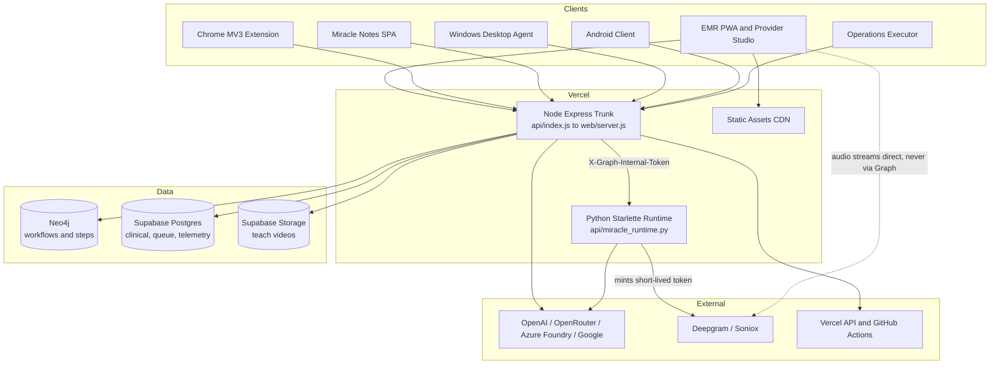
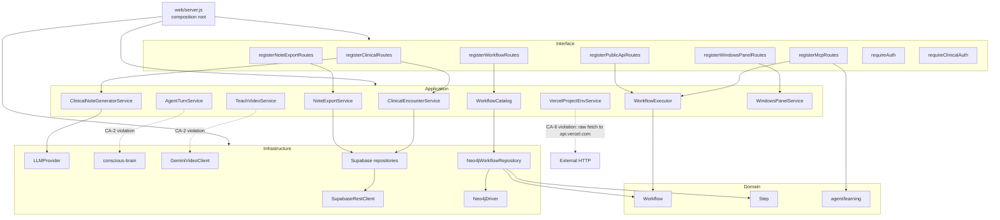
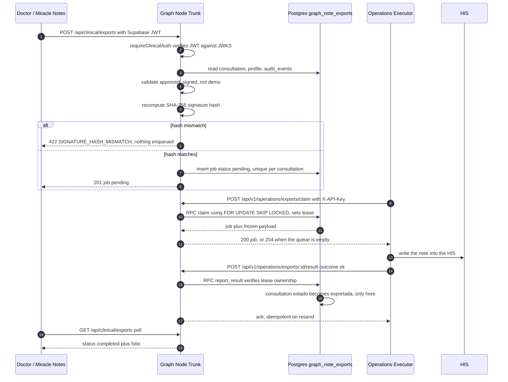
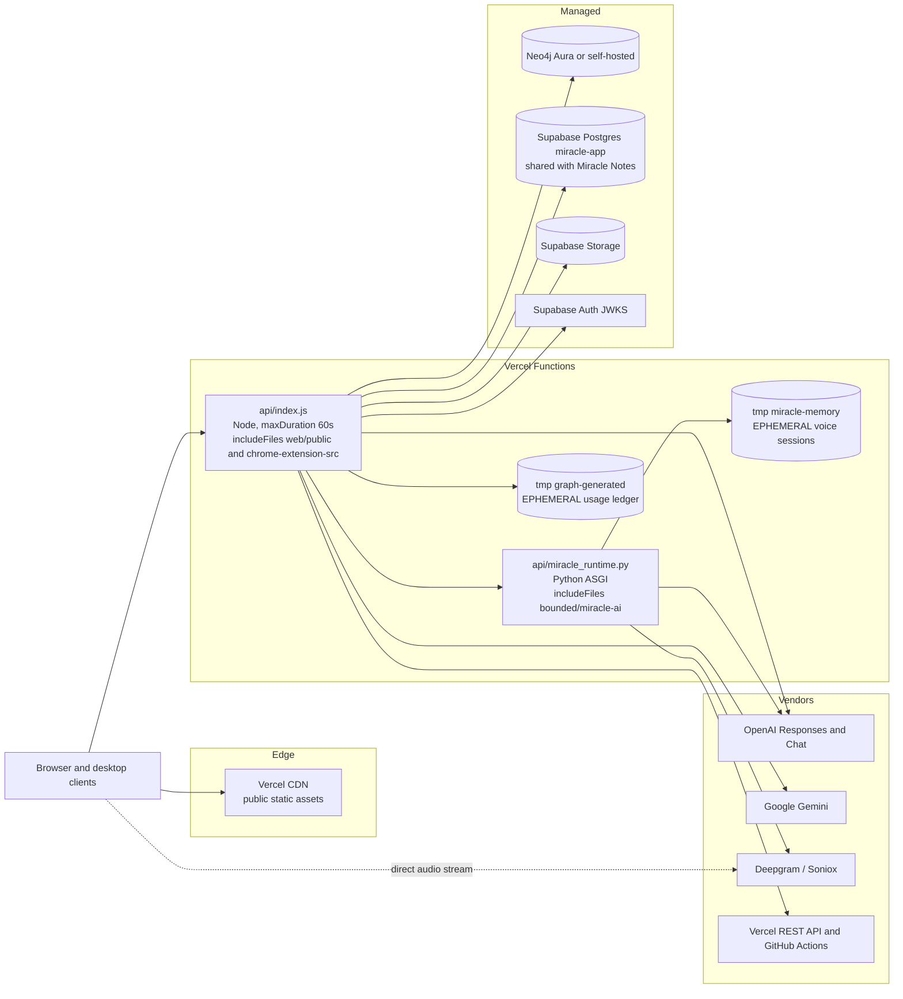
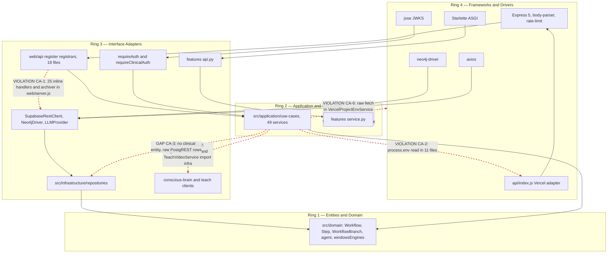
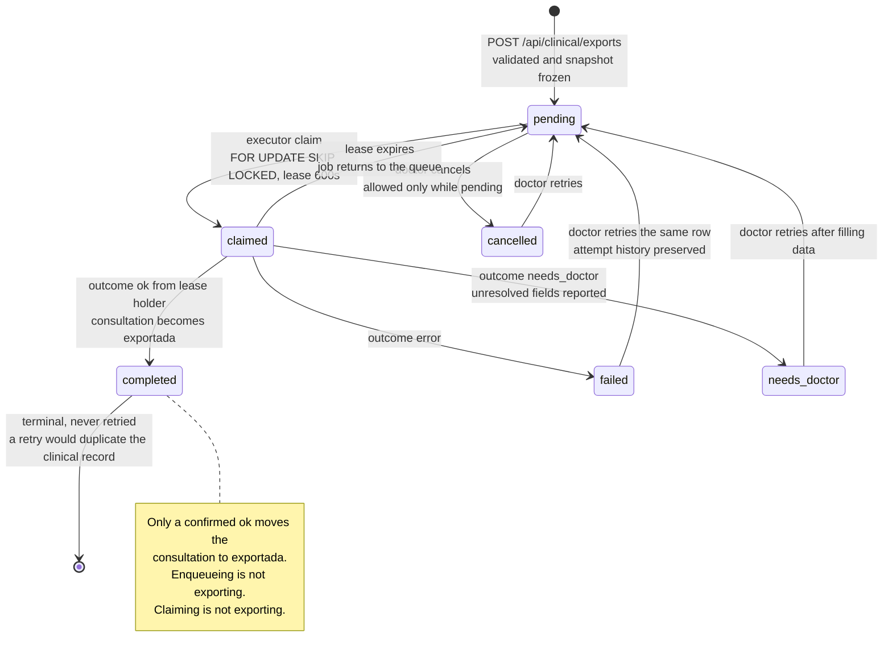

# Architecture & Infrastructure Analysis — Graph

> **Scope:** branch `main` at `origin/main`, HEAD `0cb43bc` *"Merge PR #12: exportación de nota firmada a la historia clínica"*. Working tree clean at time of analysis.
> **Evidence convention:** `Confirmed in <path>` = read directly in this pass. `Inferred from <path>` = deduced from callers, config, or runtime behavior. Where static analysis cannot decide, it says so.
> **Secrets:** no `.env` or secrets file was read (none exists locally; `.gitignore:44` ignores `.env*`). Environment variables are documented by **name and purpose only**; every value is `[not analyzed — sensitive]`.
> **Live infrastructure:** the table inventory was read from the Supabase project `miracle-app` (`zyvfamlhlmztliexvmej`) via read-only introspection, to distinguish declared schema from deployed schema.

---

# System Overview

Graph is a **workflow-learning and replay engine for arbitrary application surfaces**, plus a **clinical documentation platform** built on top of it. The two halves are one chained product: the learning engine is what tells the clinical autofill *where* each note field lives in a given EMR or HIS.

Four capability families live in this repository:

1. **Workflow learning and replay.** A browser or desktop client records user interactions; Graph persists them as `Workflow` + `Step` graphs in Neo4j and later serves back an *execution plan* — never executing it itself (`src/domain/entities/Workflow.js`, `src/application/use-cases/WorkflowExecutor.js`, Confirmed). The governing rule is stated in code: *"Graph decide QUÉ hacer, la superficie decide CÓMO tocarla"* (`web/api/registerMcpRoutes.js:17-20`, Confirmed).
2. **Clinical note engine.** Templates → encounters → transcript → LLM-generated note → validation → signature, persisted in Supabase/Postgres (`src/application/use-cases/Clinical*.js`, `supabase/migrations/20260710042652_clinical_note_engine.sql`, Confirmed).
3. **Signed-note export to the HIS.** A durable Postgres-backed job queue with lease-based pull semantics, consumed by an external Operations executor (`src/application/use-cases/NoteExportService.js`, `supabase/migrations/20260727000000_graph_note_exports.sql`, Confirmed).
4. **Client-fleet backends.** A Windows desktop agent (computer-use brain, teach-by-video, telemetry, live dashboard), an Android panel, a Chrome MV3 extension, and a PWA EMR workspace — all speaking to the same Node trunk (`web/api/registerWindows*.js`, `registerAndroidPanelRoutes.js`, `chrome-extension-src/`, `web/public/service-worker.js`, Confirmed).

The repository is a **polyglot monorepo** deployed as two sibling Vercel functions: a Node/Express trunk and a Python/Starlette voice-and-notes runtime.

---

# Architecture Summary

**Style: modular monolith, deployed serverless, with one bounded context extracted as an in-repo sidecar.**

| Aspect | Reality |
|---|---|
| Logical shape | A single Express application composed in one root (`web/server.js`, 1107 lines, Confirmed) |
| Physical shape | Two Vercel serverless functions: `api/index.js` (Node) and `api/miracle_runtime.py` (Python ASGI) (`vercel.json:7-15`, Confirmed) |
| Layering | Explicit `domain` / `application` / `infrastructure` folders under `src/`, interface layer in `web/api/` (Confirmed) |
| Bounded context | `bounded/miracle-ai` — a self-contained Python package with its own `pyproject.toml`, feature folders and integration adapters (Confirmed) |
| State | Stateless HTTP compute; all state in Neo4j, Supabase/Postgres, or ephemeral `/tmp` (Confirmed) |
| Platform coupling | Vercel-aware in code: `process.env.VERCEL` branches control cookie `Secure`, proxy trust and writable paths (`web/server.js:101,105-109,219-220,258`, Confirmed) |

The Node trunk **reverse-proxies** a fixed set of paths to the Python runtime with an internal shared-secret header, falling back to an in-process store when the runtime is not configured (`web/server.js:492-557,559-650`, Confirmed).

Two authentication realms coexist deliberately and never mix:

- **Local realm** — HMAC-signed opaque session tokens minted by Graph itself for admin and guest sessions, plus permanent client API keys. Populates `req.user` (`web/api/requireAuth.js`, Confirmed).
- **Clinical realm** — Supabase user JWTs verified offline against the project JWKS with ES256. Populates `req.clinicalUser`, never `req.user` (`web/api/requireClinicalAuth.js:1-10,80-91`, Confirmed).

---

# Main Components

## Node trunk (`web/`, `src/`, `api/index.js`)

| Component | Path | Responsibility |
|---|---|---|
| Composition root | `web/server.js` | Instantiates every service, mounts middleware, wires 18 route registrars (Confirmed) |
| Vercel adapter | `api/index.js` | Rewrites `?path=` back into `/api/...` and delegates to the Express app (Confirmed) |
| Auth — local | `web/api/requireAuth.js` | `requireAuth`, `requireAccountAuth`, `requireApiKey`, `attachWorkflowAccess` (Confirmed) |
| Auth — clinical | `web/api/requireClinicalAuth.js` | Supabase JWKS verification, institutional-admin resolution (Confirmed) |
| Route registrars | `web/api/register*.js` — 18 files | HTTP surface: learning, workflows, context, execution intelligence, clinical, exports, medical, usage, MCP, Windows agent/telemetry/panel/distribution, Android, Studio, public `/api/v1` (Confirmed) |
| Application layer | `src/application/use-cases/` — 49 files | Business orchestration with constructor-injected collaborators (Confirmed) |
| Domain | `src/domain/` — 7 files | `Workflow`, `Step`, `WorkflowBranch`, agent session/learning/MCP catalog, Windows engine taxonomy (Confirmed) |
| Infrastructure | `src/infrastructure/` — 14 files | Neo4j driver, Supabase REST client, LLM HTTP client, conscious-brain clients, Gemini video client, filesystem stores (Confirmed) |

## Python runtime (`bounded/miracle-ai`, `api/miracle_runtime.py`)

| Component | Path | Responsibility |
|---|---|---|
| ASGI entry | `api/miracle_runtime.py` | Copies the package into `/tmp` at cold start, rewrites `__miracle_target` into a path, enforces `X-Graph-Internal-Token` (Confirmed) |
| App factory | `.../app/web_app.py` | Starlette app assembling notes, runtime, voice and voice-orchestration routes plus CORS middleware (Confirmed) |
| Voice STT | `.../features/voice/service.py` + `integrations/{deepgram,soniox}/streaming.py` | Mints ephemeral streaming credentials for browser-direct STT (Confirmed) |
| Voice orchestration | `.../features/voice_orchestration/service.py` | Segment-by-segment transcript → LLM → note patch; dedupes by `segment_id`, caps history at 100 segments and 50 pending tasks (Confirmed) |
| Product LLM adapter | `.../integrations/product_llm/note_orchestrator_adapter.py` | 462 lines; the note-organizing LLM contract (Confirmed) |
| Session store | `.../features/*/session_store.py` | Filesystem-backed session state under `MIRACLE_MEMORY_ROOT` (Confirmed) |

## Clients

| Client | Path | Notes |
|---|---|---|
| EMR / Provider Studio PWA | `web/public/*.html`, `service-worker.js` | Network-first shell cache `miracle-shell-v15`; API and cross-origin requests never cached (`web/public/service-worker.js:1-30`, Confirmed) |
| Plugin runtime | `web/public/plugin/` — 11 files | Host, adapters, context, learning bridge, execution client (2004 lines) (Confirmed) |
| Chrome extension | `chrome-extension-src/graph-trainer/` | MV3; `host_permissions: ["<all_urls>"]`; 16 content scripts injected at `document_idle` (`manifest.json`, Confirmed) |
| Notes/voice SPA | `web/public/miracle/` | Served both statically and through the `/miracle` rewrite (Confirmed) |
| Windows desktop agent | external repository | Consumes `/api/v1/agent/*`, `/api/v1/teach/*`, `/api/v1/mcp`; contract pinned to `Protocol.cs` / `TeachSession.cs` (`web/api/registerWindowsAgentRoutes.js:1-10`, Inferred — the client is not in this repo) |
| Operations executor | external / simulated | Consumes `/api/v1/operations/exports/*`; simulator in `scripts/simulate-operations-executor.js` (Confirmed) |

---

# Dependency Map

## Package manifests

**Node — `package.json:32-42` (Confirmed)**

| Package | Purpose |
|---|---|
| `express@^5.2.1`, `body-parser@^2.2.2` | HTTP framework; JSON body limit raised to 16 MB (`web/server.js:216`) |
| `express-rate-limit@^8.5.2` | Two limiters: 120 req/min global on `/api`, 20 req/min on LLM-spending paths |
| `axios@^1.16.0` | LLM Chat Completions transport (`src/infrastructure/LLMProvider.js`) |
| `neo4j-driver@^6.0.1` | Workflow graph persistence |
| `jose@^6.2.3` | Supabase JWT verification via remote JWKS, loaded with a dynamic `import()` |
| `archiver@^7.0.1` | Streams the Chrome extension zip on demand (`web/server.js:950-985`) |
| `dotenv@^17.4.2` | Loads `.env.local` then `.env` |
| `playwright@^1.59.1` | **Declared but unused.** No import exists anywhere outside `package.json` / `package-lock.json` (Confirmed by repo-wide grep) |

**Python — `requirements.txt` + `bounded/miracle-ai/pyproject.toml` (Confirmed):** `starlette>=0.46.0`, `python-dotenv>=1.0.1`, `uvicorn>=0.35.0`. `uvicorn` appears only in the package manifest, not in the Vercel `requirements.txt` — the platform supplies the ASGI server. External HTTP from the Python side uses the standard library, with no vendor SDKs.

## External services

| Service | Reached from | Purpose |
|---|---|---|
| **Neo4j** | `src/infrastructure/Neo4jDriver.js` | Workflows, steps, branches, surface profiles (Confirmed) |
| **Supabase / Postgres** | `src/infrastructure/SupabaseRestClient.js` — PostgREST with service-role | Clinical templates and encounters, note-export queue, Windows and Android telemetry, agent memory, Studio log (Confirmed) |
| **Supabase Auth (JWKS)** | `web/api/requireClinicalAuth.js` | Offline ES256 verification of doctor tokens (Confirmed) |
| **Supabase Storage** | `src/infrastructure/teach/SupabaseVideoStorage.js` | Signed upload URLs for teach-by-video (Confirmed) |
| **OpenAI / OpenRouter / Azure Foundry / Google** | `src/infrastructure/LLMProvider.js` | Field matching, note generation, assistant chat, biopsy vision (Confirmed) |
| **OpenAI Responses API (computer-use)** | `src/infrastructure/conscious-brain/openaiBrain.js` | Desktop agent brain — requires the native API, not Chat Completions (`conscious-brain/config.js:5-7`, Confirmed) |
| **Google Gemini `generateContent`** | `conscious-brain/geminiBrain.js`, `teach/GeminiVideoClient.js` | Brain alternative plus video understanding (Confirmed) |
| **Deepgram / Soniox** | `bounded/.../integrations/{deepgram,soniox}/streaming.py` | Browser-direct streaming STT via short-lived tokens (Confirmed) |
| **Vercel REST API** | `src/application/use-cases/VercelProjectEnvService.js` | Provider Studio writes env vars and triggers redeploys (Confirmed) |
| **GitHub Actions API** | `src/application/use-cases/WindowsAppReleaseService.js` | Dispatches and polls the Windows installer build workflow (Confirmed) |

**Notable coupling:** the deployed Supabase project is **shared with the upstream Miracle Notes product**. Live introspection of `zyvfamlhlmztliexvmej` shows Graph's own tables (`graph_note_exports`, `graph_windows_events` — 560 rows, `graph_exec_logs` — 2022 rows, `graph_prompts`, `graph_app_users`, `graph_client_config`, `graph_memory`, `graph_learned_tools`, `graph_studio_progress`, `graph_release`, `clinical_templates` — 157 rows, `clinical_encounters` — 143 rows) sitting **beside** tables Graph does not own (`consultations` — 114 rows, `profiles`, `organizations`, `patients`, `audit_events`, `consultation_addenda`, `secretary_doctor_access`, plus unrelated `lk_*` tables). `NoteExportService` reads `consultations`, `profiles` and `audit_events` — tables owned by another product — using the service-role key, which **bypasses RLS**. The code compensates with explicit authorization checks and documents exactly why (`NoteExportService.js:119-138`, Confirmed).

## Internal module dependency graph

See Appendix Diagram 2. Verified facts:

- `src/domain/` imports **nothing** outside itself and Node's `crypto` — exhaustively verified: three import statements exist in the whole folder (`crypto`, `./Step`, `./mcpCatalog`).
- `src/application/` imports `src/infrastructure/` in exactly **4 files**: `AgentTurnService.js:28-29`, `ConsciousProviderConfigService.js:2`, `TeachVideoProviderConfigService.js:2`, `TeachVideoService.js:14-16` (Confirmed).
- Express request/response types never appear in `src/` (Confirmed by grep; the only `res.` hits are `fetch` Response objects inside `src/infrastructure/`).

---

# Execution Paths

## 1. Workflow learning

`POST /api/workflow/start` → `/api/step` (n times) → `/api/workflow/stop` (`web/api/registerLearningRoutes.js:14-82`, Confirmed). On finish, `WorkflowLearner` calls the LLM to produce a summary, an execution guide, and a per-step `valueMode` classification (`fixed` / `dynamic` / `flexible`), then persists to Neo4j and regenerates a Markdown catalog (`src/application/use-cases/WorkflowLearner.js`, `MarkdownCatalogWriter.js`, Confirmed). Authorship precedence is explicit: only steps *without* an explicit mode get filled by the classifier (`src/domain/entities/Step.js:80-84`, Confirmed).

## 2. Workflow replay through MCP

`POST /api/v1/mcp` speaks JSON-RPC 2.0 over Streamable HTTP, **stateless by design for serverless** (`registerMcpRoutes.js:1-5`, Confirmed). `tools/list` returns only workflows scoped to the surface declared in `X-Surface-Origin` / `X-Surface-Pathname`; `tools/call` returns an execution plan and never executes. `GET` returns 405 explicitly — there is no SSE stream (`registerMcpRoutes.js:152-153`, Confirmed).

Dynamic value substitution is deliberately fail-closed: when per-execution `context` is supplied and a `dynamic` step cannot be resolved, plan construction **throws** rather than replaying the recorded value — *"reproducir el valor grabado ahí sería crear al paciente equivocado en silencio"* (`WorkflowExecutor.js:68-133`, Confirmed).

## 3. Clinical note lifecycle

`POST /api/clinical/encounters` → `/transcript` → `/generate-note` → `PUT /note` (`registerClinicalRoutes.js:206-286`, Confirmed). Each encounter freezes a **template snapshot** at creation time, so later template edits cannot retroactively change an existing note (`ClinicalEncounterService.buildTemplateSnapshot`, Confirmed). Status machine: `created → recording → transcript_ready → note_generating → note_generated → completed | failed` (`ClinicalEncounterService.js:6-16`, Confirmed).

## 4. Voice dictation

The browser calls `POST /api/voice/stream-session` → Node proxies to the Python runtime with `X-Graph-Internal-Token` → the runtime mints a short-lived Deepgram or Soniox credential → **the browser streams audio directly to the STT vendor**, not through Graph (`web/server.js:744-752`, `bounded/.../features/voice/service.py`, Confirmed). Transcript segments then flow to `POST /api/voice/orchestrator/events` for LLM note patching.

This is the single most consequential infrastructure decision in the system: audio never transits Graph, so no long-lived socket and no audio bandwidth land on the serverless function.

## 5. Signed-note export to the HIS *(asynchronous)*

The only genuinely asynchronous, durable path in the system.

1. The doctor signs in Miracle Notes and presses "Exportar a HC" → `POST /api/clinical/exports` (Supabase JWT lane).
2. Graph validates: the consultation is `aprobada`, a signature is present, it is **not a demo note**, and the SHA-256 signature hash still matches current content — a mismatch is a hard `422` and nothing is enqueued (`NoteExportService.js:155-206`, Confirmed).
3. A snapshot is frozen and a row inserted into `graph_note_exports` with `status='pending'`. Idempotent through `UNIQUE(consultation_id)`, so a double click returns the same job (`NoteExportService.js:232-265`, `tests/helpers/fakeNoteExportSupabase.js:44-55`, Confirmed).
4. The Operations executor pulls with `POST /api/v1/operations/exports/claim` (API-key lane). The claim runs a Postgres RPC using `FOR UPDATE SKIP LOCKED`, so parallel executors never take the same job (`supabase/migrations/20260727000000_graph_note_exports.sql:156-186`, Confirmed).
5. The executor reports through `POST /api/v1/operations/exports/:id/result`. **Only `outcome='ok'` from the current lease holder moves the consultation to `exportada`** (`NoteExportService.js:417-466`, Confirmed).

States: `pending | claimed | completed | needs_doctor | failed | cancelled` (migration line 40, Confirmed). Lease defaults to 600 s and max attempts to 3, both env-overridable (`NoteExportService.js:24-25,101-103`, Confirmed).

## 6. Windows Live telemetry *(near-real-time)*

The desktop client posts to `/api/v1/agent/register` and `/api/v1/agent/events` (API key); `WindowsTelemetryService` writes to `graph_windows_events` (Confirmed). The admin dashboard reads `GET /api/windows/users/:email/events/stream`, which is **SSE-formatted but polled**: a 400 ms `setInterval` queries Supabase for `id > lastId`, pings every 15 s, and hard-closes at 50 s with a planned `bye` event so the client reconnects without backoff (`registerWindowsPanelRoutes.js:67-153`, Confirmed). The client uses streaming `fetch` rather than `EventSource` specifically so the bearer token stays out of the query string (comment at lines 70-74, Confirmed).

## 7. Desktop agent turn loop

`POST /api/v1/agent/turn` — one call per turn, with an opaque `session` blob echoed by the client and memory in `graph_agent_memory` backed by an in-process fallback (`registerWindowsAgentRoutes.js:23-30`, `web/server.js:195-206`, Confirmed). The brain uses **native provider APIs** — OpenAI Responses with computer-use, Gemini `generateContent` with function calling and vision — which is precisely why it bypasses `LLMProvider` (`conscious-brain/config.js:5-7`, Confirmed).

---

# Infrastructure Requirements

| # | Component | Purpose | Runtime characteristics | Processing cost | Latency sensitivity | Deployment style | Special constraints | Recommended optimizations |
|---|---|---|---|---|---|---|---|---|
| 1 | **Node API trunk** (`api/index.js` → `web/server.js`) | All HTTP: auth, workflows, clinical, exports, panels | Stateless, ephemeral, I/O-bound | Low–Medium | High | Serverless | `maxDuration: 60 s` (`vercel.json:10`); 16 MB JSON body; cold start instantiates ~40 service objects plus both DB clients (`web/server.js:111-214`) | Lazy-instantiate the Windows, Android and Studio stacks — most requests never touch them; split the composition root per route group |
| 2 | **Python voice runtime** (`api/miracle_runtime.py`) | STT credential minting, note orchestration | Stateless HTTP; session state on the `/tmp` filesystem | Medium | High | Serverless | **`copytree` of the whole package into `/tmp` on every cold start** (`api/miracle_runtime.py:17-33`); `/tmp` is per-instance and non-durable, so `MIRACLE_MEMORY_ROOT` sessions silently vanish between instances | Move session state to Supabase; ship the package as a dependency instead of copying it at boot |
| 3 | **Neo4j** | Workflow graph store | Stateful, always-on, connection-oriented | Medium | High | Managed (Aura) or dedicated | A new driver is built per cold start with no pooling across invocations; the driver falls back from routing to direct bolt on discovery failure (`Neo4jDriver.js:95-111`) | Cap `maxConnectionPoolSize` at 1–2 per instance; add an explicit connection-acquisition timeout; consider a connection proxy as instance count grows |
| 4 | **Supabase / Postgres** | Clinical data, export queue, telemetry, config | Stateful, always-on | Medium–High | High | Managed | Accessed over PostgREST with the **service-role key, bypassing RLS** (`SupabaseRestClient.js:1-2,33-37`); the SSE poller issues one query per connected user every 400 ms | Add per-connection statement timeouts; replace the SSE polling loop with Supabase Realtime; review the index on `graph_windows_events` |
| 5 | **Export queue** (`graph_note_exports`) | Durable HIS-write jobs | Stateful, durable, pull-based | Low on the Graph side | Low | Managed table plus RPCs | Correctness lives in Postgres: `FOR UPDATE SKIP LOCKED`, a unique constraint, lease expiry (migration lines 77-85, 156-186) | Add a dead-letter view and an alert when `pending` age exceeds the lease; expose queue depth |
| 6 | **LLM providers** | Note generation, field matching, assistant, biopsy vision | External, stateless, latency-dominant | **High** in both cost and time | Medium | External API | **`LLMProvider.postChatCompletions` sets no timeout and no retry** — a single `axios.post` (`LLMProvider.js:153-166`); a stalled provider consumes the entire 60 s budget | Add an explicit timeout plus bounded retry with jitter; consider streaming for long note generation |
| 7 | **Conscious brain** (desktop agent) | Computer-use reasoning loop | External, stateless per turn | **Very High** | Medium | External API | Retries transient statuses up to 4 attempts (`openaiBrain.js:65`, `geminiBrain.js:43`); one turn per HTTP request keeps each call within 60 s | Keep the `effort=low` default, already in place (`config.js:69`); enforce a per-turn wall-clock budget |
| 8 | **Teach-by-video** | Gemini video understanding | External; multi-step upload then poll | **Very High** | Low | External API | Upload → `files.get` polling → `generateContent`, all inside a 60 s function (`GeminiVideoClient.js:37-148`) | Move to the export-queue pattern: enqueue and let a worker poll, rather than holding a serverless request open |
| 9 | **STT vendors** (Deepgram / Soniox) | Streaming transcription | Long-lived WebSocket — **browser to vendor, never through Graph** | High, but vendor-side | **Critical** | External API | Token TTL defaults to 60 s (`.env.example:22`); Graph only mints credentials | Already optimal — do not route audio through the function |
| 10 | **Windows Live SSE** (`/events/stream`) | Live admin dashboard | Long-lived HTTP response | Medium | Medium | Serverless — **poor fit** | 50 s hard cap under a 60 s function limit; a 400 ms poll means up to 125 Supabase queries per connection window | Move to Supabase Realtime, or host this single route on an always-on runtime |
| 11 | **Static assets and PWA** | EMR shell, Studio, plugin runtime | Stateless, cacheable | Low | Low | CDN | `build:vercel` is a plain `cpSync` of `web/public` → `public` (`scripts/build-vercel.js`); no bundling, minification or content hashing — 2413-line and 2004-line scripts ship raw | Add a bundler with content hashing; the service worker's manual `SHELL` array currently has to be hand-maintained on every file addition |
| 12 | **Usage ledger** (`UsageLedgerStore`) | AI spend accounting | **Filesystem JSONL** | Low | Low | Serverless — **broken fit** | Writes to `/tmp/graph-generated/usage/ai-usage-events.jsonl` on Vercel (`web/server.js:104-109,123`); `/tmp` is per-instance and ephemeral, so **usage data is lost and the dashboard under-reports** | Move the ledger to Postgres; this is a data-loss defect, not a tuning item |
| 13 | **Chrome extension** | Injects the runtime into arbitrary pages | Client-side | Low | Low | Zip served on demand | `<all_urls>` host permission plus `tabs`, with 16 content scripts at `document_idle` (`manifest.json`) | Narrow the host permissions or move to `activeTab` plus optional permissions before any store submission |

---

# Processing Cost and Runtime Notes

**Measurable from code:**

- Rate limits: 120 req/min per IP on `/api`, and 20 req/min on 11 LLM-spending prefixes (`web/server.js:327-375`, Confirmed).
- Request body cap: 16 MB, sized for base64 biopsy images (`web/server.js:216` with `/api/v1/biopsy/extract`, Confirmed).
- Function ceiling: 60 s for `api/index.js`. `api/miracle_runtime.py` declares no `maxDuration` and therefore inherits the plan default (`vercel.json:7-15`, Confirmed).
- SSE stream: 400 ms tick, 15 s ping, 50 s maximum duration (`registerWindowsPanelRoutes.js`, Confirmed).
- Export queue: 600 s lease, 3 attempts (`NoteExportService.js:24-25`, Confirmed).
- Health-check timeouts: Neo4j 2000 ms (`Neo4jDriver.js:147`), Miracle sidecar probe 1500 ms (`web/server.js:710`), both Confirmed.
- Voice orchestration memory bounds: the last 100 segment ids and 50 pending tasks (`voice_orchestration/service.py:126,130`, Confirmed).

**`[estimate]` — not measurable from code:**

- Node cold start with ~40 service instantiations plus Neo4j driver construction: `[estimate]` 300–800 ms.
- Python cold start dominated by `shutil.copytree` of `bounded/miracle-ai/src`: `[estimate]` 400 ms–1.5 s, scaling with package size.
- LLM note generation round trip: `[estimate]` 3–15 s depending on model and transcript length — the dominant term in the clinical loop.
- Teach-by-video end to end: `[estimate]` 20–120 s, which is why it sits uncomfortably inside a 60 s function.

**CPU and GPU:** no GPU workload runs in this repository, and all heavy inference is vendor-side. No CPU-bound loop exists outside JSON serialization. The system is I/O-bound end to end.

---

# Optimization Opportunities

Ranked by impact divided by effort.

1. **Move the usage ledger off `/tmp`.** It is silently losing data in production today (`UsageLedgerStore`, `web/server.js:104-109`). Low effort, correctness win.
2. **Add timeout and bounded retry to `LLMProvider`.** A single unguarded `axios.post` currently governs every LLM path (`LLMProvider.js:153-166`). Low effort, removes the largest availability risk.
3. **Move voice-orchestration session state off `/tmp`.** Sessions are per-instance today, so a dictation that lands on a second instance loses its dedup set and its applied-block anchor (`api/miracle_runtime.py:14,38`, `session_store.py`). Medium effort.
4. **Replace the SSE polling loop with Supabase Realtime.** Removes up to 125 queries per connection window and the 50 s reconnect dance (`registerWindowsPanelRoutes.js:122-150`). Medium effort.
5. **Lazy-instantiate services in the composition root.** `web/server.js:111-214` builds the Windows, Android, Studio, biopsy, teach and agent stacks on every cold start regardless of the route being served. Medium effort, direct cold-start win.
6. **Move teach-by-video to the export-queue pattern.** The queue machinery already exists and is proven; reuse it rather than holding a serverless request open through an upload-poll-generate cycle. Medium effort.
7. **Drop `playwright`.** Declared, unused, and heavy to install (`package.json:41`). Trivial effort.
8. **Bundle and hash static assets.** `build:vercel` is a raw copy (`scripts/build-vercel.js`) and the service worker's `SHELL` array is hand-maintained, so it will drift (`service-worker.js:6-27`). Medium effort.
9. **Declare `maxDuration` for `api/miracle_runtime.py`**, currently implicit (`vercel.json:12-14`). Trivial effort.

---

# Clean Architecture Evaluation

## Score table

| # | Principle | Score (0–4) | Compliance % | Status |
|---|---|---|---|---|
| CA-1 | Layer Separation | 3 | 75% | 🟡 |
| CA-2 | Dependency Rule | 3 | 75% | 🟡 |
| CA-3 | Entities / Domain Model | 2 | 50% | 🟠 |
| CA-4 | Use Cases / Application Layer | 3 | 75% | 🟡 |
| CA-5 | Ports & Adapters | 2 | 50% | 🟠 |
| CA-6 | Frameworks at the Edge | 3 | 75% | 🟡 |
| CA-7 | Testability | 3 | 75% | 🟡 |
| | **Overall** | **19/28** | **68%** | 🟡 |

Status legend: 🔴 0–25% · 🟠 26–50% · 🟡 51–75% · 🟢 76–100%. Overall = (19 ÷ 28) × 100 = 68%.

## Per-principle narrative

### CA-1 — Layer Separation · **3**

Four layers exist as real folders with real boundaries. The leak is that the composition root doubles as a controller.

**Compliant**
- `src/domain/` · `src/application/use-cases/` · `src/infrastructure/` · `web/api/` is a genuine four-ring layout, not decorative naming.
- `web/api/registerClinicalRoutes.js` contains only HTTP concerns — id normalization, response shaping, error-code mapping (`respondClinicalError:67-77`) — and delegates every decision to services.
- The Python side mirrors it: `features/*/api.py` for transport, `features/*/service.py` for logic, `integrations/*` for vendors.

**Violations**
- `web/server.js` holds roughly 25 inline route handlers alongside its wiring, including an authorization check repeated verbatim 14 times (`if (!req.workflowAccess?.canManageGlobalWorkflows) return 403` at lines 653, 660, 675, 682, 693, 700, 813, 820, 833, 840, 857, 875, 882, 899…).
- Zip-streaming infrastructure is inlined in a route handler, with `require('archiver')` mid-function plus stream error handling (`web/server.js:950-985`).
- `registerClinicalRoutes.js:11-19` derives a stable UUID via SHA-256 in the interface layer; that is an identity rule, not transport.

**Most impactful improvement:** extract the repeated admin guard into a `requireProviderAdmin` middleware — the pattern already exists in `registerWindowsPanelRoutes.js` — and move the inline handlers into a `registerProviderRoutes.js`. That alone would roughly halve `web/server.js` and make the composition root purely declarative.

### CA-2 — Dependency Rule · **3**

Inward-pointing dependencies hold at the domain boundary and break in four application files.

**Compliant**
- `src/domain/` imports nothing outward — verified exhaustively: three import statements exist in the entire folder, and they are `crypto`, `./Step` and `./mcpCatalog`.
- `WorkflowExecutor.js` receives `catalogService` and `dynamicValueResolver` by constructor and knows nothing about Neo4j, HTTP or Supabase.
- `NoteExportService.js:93-105` guards its own dependencies (`throw new Error('NoteExportService requires a repository')`) rather than reaching for a concrete one.

**Violations**
- `AgentTurnService.js:28-29` imports `../../infrastructure/conscious-brain` and its config directly — an application class binding to a concrete vendor client.
- `TeachVideoService.js:14-16` imports the Gemini client, the Supabase storage signer and infra config.
- `ConsciousProviderConfigService.js:2` and `TeachVideoProviderConfigService.js:2` do the same for config resolution.
- Beyond imports, **11 application files read `process.env` directly** across 46 occurrences, which is an inward dependency on the deployment environment.

**Most impactful improvement:** invert the four infrastructure imports into injected ports wired in `web/server.js`, matching how every other service in that file is already constructed. The composition root is already the right place; these four simply skipped it.

### CA-3 — Entities / Domain Model · **2**

Half the system has a real domain model. The clinical half has none.

**Compliant**
- `src/domain/entities/Workflow.js` is a genuine entity with behavior: `inferVariables()` derives execution variables from steps, and `isTransversalClickStep()` encodes a real business rule about which click targets are substitutable, including a Spanish-language generic-target blocklist (lines 35-132).
- `src/domain/entities/Step.js` normalizes and validates its own invariants — `valueMode` restricted to a closed set, `nodeAction` to four values — with the authorship-precedence rule (`valueModeExplicit`) encoded as domain knowledge (lines 58-84).
- Zero framework or ORM decorators appear anywhere in `src/domain/`; these are plain classes.

**Violations**
- **There is no clinical entity.** Encounters, templates, notes, consultations and exports exist only as untyped JSON flowing from PostgREST through services to HTTP. `NoteExportService` reasons over `row.status`, `row.payload`, `consultation.estado` and `firma.hash` — raw column names, roughly 40 occurrences.
- Clinical business rules that belong on entities live as module constants and static methods instead: `STATUSES` and `CONSULTATION_TYPES` in `ClinicalEncounterService.js:5-16`, `RETRYABLE` and `VALID_OUTCOMES` in `NoteExportService.js:26-31`.
- `WorkflowBranch.js` exists, but branch-planning logic lives in the application-layer `WorkflowBranchPlanner`, leaving the entity thin.

**Most impactful improvement:** introduce `src/domain/entities/ClinicalEncounter.js` and `NoteExport.js` owning their own status machines (`canTransitionTo`, `isRetryable`, `isSignatureValid`). The rules are already written and already correct — they are simply in the wrong layer, so this is a move rather than a redesign.

### CA-4 — Use Cases / Application Layer · **3**

The strongest structural feature of this codebase.

**Compliant**
- 49 dedicated use-case classes under `src/application/use-cases/`, each with a single responsibility and constructor-injected collaborators.
- `web/server.js:111-214` is a textbook composition root: every dependency graph is assembled in one place and passed down, and nothing constructs a repository mid-flight.
- Dependency injection is used as a *design lever* rather than ceremony: `NoteExportService`'s `resolvePlan` is deliberately left un-injected, with a comment explaining that activating server-side plan resolution is a one-line injection that changes no contracts (`web/server.js:152-161`, `NoteExportService.js:84-91`).
- Optional dependency groups are validated as groups, so partial wiring throws rather than half-working (`registerClinicalRoutes.js:90-96`).

**Violations**
- Four services construct their own infrastructure instead of receiving it (see CA-2).
- `VercelProjectEnvService.js:3-7` hardcodes a **production project id and team id as defaults** (`prj_aGN8aRUyPEyWX53NjdTT4fOZ2h15`, `jose-david-s-projects-22dd4300`) — deployment identity embedded in an application class.
- `LLMProvider` instances are constructed in the root with string prefixes (`'MIRACLE_ASSISTANT'`, `'MIRACLE_BIOPSY'`), so provider selection is stringly-typed configuration rather than an injected policy (`web/server.js:112-120`).

**Most impactful improvement:** remove the hardcoded Vercel identifiers and require them from configuration. A service should not carry another environment's identity as a fallback.

### CA-5 — Ports & Adapters · **2**

The *shape* of ports and adapters is present everywhere; the *contract* is nowhere.

**Compliant**
- Real adapters exist and hide their protocol: `SupabaseRestClient` wraps PostgREST with `select`/`insert`/`update`/`rpc`, `Neo4jDriver` wraps Bolt, `LLMProvider` wraps Chat Completions.
- `Neo4jWorkflowRepository` genuinely maps rows to domain objects and handles JSON-column serialization in both directions (`serializeAllowedOptions`, `parseJsonObject`, lines 6-45).
- Outbound DTOs exist and are purposeful: `toPublicExport()` deliberately strips `payload` so PHI never reaches the UI, with the reason documented (`NoteExportService.js:44-79`); `templateResponse()` and `encounterResponse()` shape clinical output (`registerClinicalRoutes.js:34-65`).
- Substitutability is proven rather than asserted: the same `SupabaseNoteExportRepository` runs against an in-memory PostgREST subset in tests with zero production-code changes (`tests/helpers/fakeNoteExportSupabase.js`).

**Violations**
- **No port is declared anywhere.** `src/domain/` contains no repository interface, no abstract class and no JSDoc `@interface`. Every port is a duck-typed constructor parameter, discoverable only by reading the implementation.
- The clinical and export contexts have **no inbound mapping**: repositories return raw PostgREST rows and the application layer consumes database column names directly (`row.consultation_id`, `row.lease_expires_at`, `consultation.estado`). DTO translation happens only on the way out.
- `AgentTurnService` and `TeachVideoService` reach vendor clients through direct module imports rather than through a port at all.

**Most impactful improvement:** add JSDoc `@typedef` port contracts under `src/domain/ports/` for the four repositories that already exist behaviorally. In a CommonJS codebase this is the highest-value, lowest-cost step: it makes the contracts reviewable and IDE-checkable without introducing TypeScript.

### CA-6 — Frameworks at the Edge · **3**

The framework boundary is airtight. The I/O-driver boundary is not.

**Compliant**
- A repo-wide grep confirms **no `require('express')`, no `req.` and no `res.json/status/send` anywhere under `src/`**. The only `res.` occurrences in `src/infrastructure/` are `fetch` Response objects, which is correct for an adapter.
- Business services take and return plain objects while the HTTP registrars translate. `registerWindowsAgentRoutes.js:26-29` is the clearest case: the use case returns `{status, json}` and the route writes it verbatim, so the framework touches nothing but the wire.
- The Python side keeps Starlette confined to `app/web_app.py` and `features/*/api.py`; services take dataclasses (`VoiceOrchestratorEvent`) and return dataclasses (`VoiceOrchestratorResponse`).
- The edge is genuinely swappable in practice: `api/index.js` adapts Vercel's function signature to the same Express app in a 15-line shim, and the test scripts mount the same registrars on a bare `express()` instance.

**Violations**
- **Raw outbound HTTP lives in the application layer.** `VercelProjectEnvService.js:36,73,89,119` calls `api.vercel.com` with bare `fetch`; `WindowsAppReleaseService.js:91,122,171,191` calls `api.github.com` the same way. These are I/O drivers sitting two rings too far in.
- `ClinicalRawTranscriptionService.js:49` calls `api.deepgram.com` from the application layer. It is the mildest case — `fetchImpl` is injectable, so it is testable — but the vendor URL and protocol still live in a use case.
- Provider base URLs for four vendors are hardcoded as constants across five application services (`GraphProviderConfigService.js:25,37,49` and siblings), so vendor knowledge is spread through the application ring.

**Most impactful improvement:** move the three outbound HTTP callers into `src/infrastructure/` adapters injected as ports. This is the same fix as CA-2's, applied from the other direction, and it would lift both scores at once.

### CA-7 — Testability · **3**

Inner layers are provably testable without any external system — demonstrated, not merely claimed.

**Compliant**
- `npm test` was executed during this analysis and **passed with exit code 0, with no database, no server and no API credentials**. The note-export suite alone runs 37 end-to-end assertions covering double-click idempotency, cross-organization authorization, lease ownership and the absence of PHI in the executor payload.
- Purpose-built fakes exist with documented boundaries: `tests/helpers/fakeNoteExportSupabase.js:1-10` states precisely which semantics it can and cannot reproduce, and points at the real-Postgres suite for the rest.
- Integration tests degrade gracefully rather than failing the suite — `verify-note-exports-db.js` skipped with exit 0 when `psql` was absent, as observed in the run.
- Pure-domain tests need no harness at all: `verify-tree-node-steps.js` imports `Step` and `WorkflowExecutor` directly and asserts the entity-to-plan contract.

**Violations**
- The 11 application files reading `process.env` directly are not unit-testable without environment manipulation, notably every `*ProviderConfigService`.
- There is no test framework, no assertion library beyond `node:assert` and no coverage measurement. Test selection is a hand-maintained `&&` chain in `package.json:26`, so a new script stays silently excluded until someone edits that line.
- Large surfaces have no tests at all: `WindowsPanelService`, `AndroidPanelService`, `StudioProgressService`, `TeachVideoService`, `AgentTurnService`, `BiopsyExtractionService`, and the entire `web/public/` client including a 2413-line and a 2004-line file.

**Most impactful improvement:** inject configuration into the `*ProviderConfigService` constructors instead of reading `process.env` at call time. That closes the last structural testability gap, after which adding a runner and coverage becomes a tooling decision rather than a refactor.

## CA Improvement Roadmap

Ordered by score gain first, then by ascending effort.

| Priority | Action | Effort | Affected Files / Paths | CA Principles |
|---|---|---|---|---|
| **P1** | Move outbound HTTP out of the application layer into infrastructure adapters injected as ports | Medium | `VercelProjectEnvService.js:36,73,89,119`, `WindowsAppReleaseService.js:91,122,171,191`, `ClinicalRawTranscriptionService.js:49` → new `src/infrastructure/*` | CA-6, CA-2, CA-4 |
| **P2** | Declare port contracts as JSDoc `@typedef` in a new `src/domain/ports/` for the workflow, clinical-template, clinical-encounter and note-export repositories | Low | `src/domain/ports/*` (new), `src/infrastructure/repositories/*` | CA-5, CA-2 |
| **P3** | Introduce `ClinicalEncounter` and `NoteExport` entities owning their status machines; move `STATUSES`, `RETRYABLE`, `VALID_OUTCOMES` and the signature-validity rule onto them | Medium | `src/domain/entities/` (new), `ClinicalEncounterService.js:5-16`, `NoteExportService.js:26-31,155-206` | CA-3, CA-1 |
| **P4** | Inject configuration into the four services that import infrastructure directly and wire them in the composition root like every other service | Medium | `AgentTurnService.js:28-29`, `TeachVideoService.js:14-16`, `ConsciousProviderConfigService.js:2`, `TeachVideoProviderConfigService.js:2`, `web/server.js` | CA-2, CA-4, CA-7 |
| **P5** | Extract a `requireProviderAdmin` middleware and move the ~25 inline provider routes out of the composition root into `registerProviderRoutes.js` | Medium | `web/server.js:652-1018` → new `web/api/registerProviderRoutes.js` | CA-1, CA-4 |
| **P6** | Replace direct `process.env` reads in the `*ProviderConfigService` classes with constructor-injected config objects | Medium | 11 files in `src/application/use-cases/`, 46 occurrences | CA-7, CA-2 |
| **P7** | Add inbound mapping in the clinical repositories so services stop consuming PostgREST column names | High | `SupabaseClinicalEncounterRepository.js`, `SupabaseNoteExportRepository.js`, `NoteExportService.js` | CA-5, CA-3 |
| **P8** | Remove the hardcoded Vercel project and team identifiers | Low | `VercelProjectEnvService.js:3-7` | CA-4 |
| **P9** | Add a lint rule banning `express`, `req` and `res` identifiers under `src/` to lock in the framework boundary | Low | lint configuration (new) | CA-6 |

---

# Risks and Constraints

**Correctness and data loss**

1. **The usage ledger writes to ephemeral `/tmp` on Vercel.** `UsageLedgerStore` persists AI-spend events to `/tmp/graph-generated/usage/ai-usage-events.jsonl` (`web/server.js:104-109,123`). `/tmp` is per-instance and discarded, so the usage dashboard is under-reporting in production today. **Confirmed in code; the production consequence is inferred from the Vercel execution model.**
2. **Voice-orchestration sessions live on the same ephemeral filesystem.** `MIRACLE_MEMORY_ROOT` defaults to `/tmp/miracle-memory` (`api/miracle_runtime.py:14,38`). A dictation whose segments land on different instances loses its `processed_segment_ids` dedup set and its applied-note-block anchor, so segments can be reapplied.

**Availability**

3. **No timeout or retry on any LLM call.** A single `axios.post` with no `timeout` option (`LLMProvider.js:153-166`) means a slow provider consumes the full 60 s function budget and returns a 500.
4. **SSE on serverless.** The live dashboard stream is capped at 50 s inside a 60 s function and reconnects continuously (`registerWindowsPanelRoutes.js:124`). It works, but it is a workaround for a platform mismatch, and each connection issues up to 125 Supabase queries per window.
5. **Neo4j connection lifecycle.** A new driver is constructed per cold start with no pool tuning (`web/server.js:111`, `Neo4jDriver.js:21`). Under concurrent instance scale-up this can exhaust the server's connection budget.

**Security**

6. **The service-role key bypasses RLS on tables Graph does not own.** `SupabaseRestClient` uses the service-role key for everything (`SupabaseRestClient.js:1-2`), and `NoteExportService` reads `consultations`, `profiles` and `audit_events`, which belong to Miracle Notes. The code compensates with explicit ownership and organization checks and documents exactly why (`NoteExportService.js:119-138`), but the safety property now depends on that application code being right rather than on the database enforcing it.
7. **Permissive CORS when `ALLOWED_ORIGINS` is empty.** Empty is permissive outside production and closed inside it (`web/server.js:250-262`) — correct, but a misconfigured `NODE_ENV` on a non-Vercel host would silently open CORS.
8. **`TEMPORARY_DISABLE_AUTH` exists in two realms.** Both guard against production (`requireClinicalAuth.js:97`, `requireAuth.js:67,282-285`), but `isAuthBypassEnabled` itself is *not* production-gated — the gate lives at the call sites. A new call site that forgets the check would disable auth in production. **Confirmed in code.**
9. **The Chrome extension requests `<all_urls>` plus `tabs`** and injects 16 content scripts into every page (`manifest.json:6-12,20-45`).
10. **The admin session secret is randomized per process when unset.** A sensible default (`requireAuth.js:17-20`), but on serverless every instance generates a different secret, so admin sessions break unpredictably across instances unless `LOCAL_ADMIN_SECRET` is set. **Confirmed in code; the multi-instance consequence is inferred.**
11. **The internal Node↔Python token is optional.** If `GRAPH_INTERNAL_TOKEN` is unset, the Python runtime accepts internal requests unauthenticated (`api/miracle_runtime.py:78-86`, Confirmed). It must be set in production.

**Operational**

12. **A single shared Postgres serves two products.** Graph's tables and Miracle Notes' tables coexist in `zyvfamlhlmztliexvmej` (verified live). A schema change or load spike in one product affects the other.
13. **No bundling for a large client surface.** `build:vercel` is one `cpSync` (`scripts/build-vercel.js`); the two largest client files are 2413 and 2004 lines, shipped raw and unhashed.
14. **The service-worker `SHELL` array is hand-maintained** (`service-worker.js:6-27`) and will silently drift from the actual asset list.
15. **`playwright` is installed but unused**, costing install time and dependency surface for nothing (`package.json:41`, confirmed by repo-wide grep).

---

# Open Questions

These cannot be resolved by static analysis of this repository:

1. **Is Neo4j deployed, and where?** `NEO4J_URI` is required for the server to serve workflows (`Neo4jDriver.js:5-13`), but no deployment manifest for Neo4j exists in the repo. Aura versus self-hosted materially changes the topology in Diagram 4.
2. **Does the Operations executor exist in production?** `GRAPH_NOTE_EXPORT_WORKFLOW_ID` is required or export creation returns 503 (`NoteExportService.js:208-218`), and `graph_note_exports` currently has **0 rows** in the live project — consistent with either "not yet in use" or "not yet deployed". The only executor in this repo is `scripts/simulate-operations-executor.js`.
3. **Does `MIRACLE_RUNTIME_URL` point at the sibling Vercel function or an external host?** The code supports both and falls back to `/api/miracle-runtime` on Vercel (`web/server.js:466-475`).
4. **Which LLM providers are actually configured per surface?** Six independent provider slots exist (`GRAPH_LLM_*`, `MIRACLE_ASSISTANT_LLM_*`, `MIRACLE_BIOPSY_LLM_*`, `MIRACLE_CONSCIOUS_LLM_*`, teach-video, product-LLM). All values are `[not analyzed — sensitive]`.
5. **Is the Windows desktop client's contract still in sync?** `registerWindowsAgentRoutes.js:1-10` states the JSON shape is pinned to `Protocol.cs` and `TeachSession.cs` in another repository. Nothing here can verify that.
6. **Is `graph_workflows` (0 rows, live) intended to replace Neo4j?** A Supabase table with that name exists, but no code in this repository writes to it.
7. **Who owns `lk_prestadores`, `lk_documentos`, `lk_mascotas` and `lk_mascotas_perdidas`?** They are present in the shared project and unreferenced anywhere in this codebase.
8. **Is `Starlette(debug=True)` intentional in production?** `app/web_app.py:45` hardcodes it, which exposes stack traces on error responses.

---

# Infrastructure Recommendation Summary

**Keep serverless for the trunk.** The Node API is stateless, I/O-bound and bursty, which is a good fit. The 60 s ceiling is comfortable for every path except teach-by-video.

**Recommended target topology**

| Workload | Recommendation | Reason |
|---|---|---|
| Node API trunk | **Vercel serverless**, unchanged | Stateless, I/O-bound, comfortably within limits |
| Python voice runtime | **Vercel serverless**, but move session state to Postgres | Same fit; only the `/tmp` state is wrong |
| Neo4j | **Managed (Aura)** with a per-instance pool cap of 1–2 | Avoids connection exhaustion under scale-out |
| Supabase / Postgres | **Managed**, unchanged; consider separating Graph's tables from Miracle Notes' | Blast-radius isolation between two products |
| Note-export queue | **Keep it in Postgres** | `FOR UPDATE SKIP LOCKED` plus a unique constraint is the right primitive; do not add a broker |
| Windows Live stream | **Supabase Realtime**, or move this one route to a container | SSE on a 60 s function is a workaround, not a design |
| Teach-by-video | **Queue plus worker**, reusing the export-queue pattern | It exceeds the serverless budget by design |
| Usage ledger | **Postgres table** | `/tmp` loses data |
| Static assets | **CDN with a real build step** | Currently raw, unhashed and unbundled |
| STT audio | **Unchanged — browser to vendor direct** | Already the correct decision; do not route audio through the function |

**Do not add** a message broker, a container orchestrator or a cache tier at current scale. The queue primitive is already correct, and nothing in this system is CPU-bound or read-hot enough to justify Redis.

**Sequence:** fix the two `/tmp` persistence defects (Risks 1–2), then add LLM timeouts, then work the CA roadmap P1–P4. The first three items are hours of work and remove the only active production defects found in this pass.

---

# Appendix: Mermaid Diagrams

## 1. High-level system architecture

```mermaid
flowchart TD
    subgraph Clients
        EMR[EMR PWA and Provider Studio]
        EXT[Chrome MV3 Extension]
        SPA[Miracle Notes SPA]
        WIN[Windows Desktop Agent]
        AND[Android Client]
        OPS[Operations Executor]
    end

    subgraph Vercel
        NODE[Node Express Trunk<br/>api/index.js to web/server.js]
        PY[Python Starlette Runtime<br/>api/miracle_runtime.py]
        CDN[Static Assets CDN]
    end

    subgraph Data
        NEO[(Neo4j<br/>workflows and steps)]
        SUPA[(Supabase Postgres<br/>clinical, queue, telemetry)]
        STOR[(Supabase Storage<br/>teach videos)]
    end

    subgraph External
        LLM[OpenAI / OpenRouter / Azure Foundry / Google]
        STT[Deepgram / Soniox]
        VAPI[Vercel API and GitHub Actions]
    end

    EMR --> CDN
    EMR --> NODE
    EXT --> NODE
    SPA --> NODE
    WIN --> NODE
    AND --> NODE
    OPS --> NODE

    NODE -->|X-Graph-Internal-Token| PY
    NODE --> NEO
    NODE --> SUPA
    NODE --> LLM
    NODE --> VAPI
    NODE --> STOR
    PY --> LLM
    PY -->|mints short-lived token| STT
    EMR -.->|audio streams direct, never via Graph| STT
```

## 2. Module and service dependency graph

```mermaid
graph TD
    ROOT[web/server.js<br/>composition root]

    subgraph Interface
        RC[registerClinicalRoutes]
        RN[registerNoteExportRoutes]
        RM[registerMcpRoutes]
        RW[registerWorkflowRoutes]
        RWP[registerWindowsPanelRoutes]
        RPA[registerPublicApiRoutes]
        AUTH[requireAuth]
        CAUTH[requireClinicalAuth]
    end

    subgraph Application
        CES[ClinicalEncounterService]
        CNG[ClinicalNoteGeneratorService]
        NES[NoteExportService]
        WEX[WorkflowExecutor]
        WCA[WorkflowCatalog]
        ATS[AgentTurnService]
        TVS[TeachVideoService]
        VPE[VercelProjectEnvService]
        WPS[WindowsPanelService]
    end

    subgraph Domain
        WF[Workflow]
        ST[Step]
        AGL[agent/learning]
    end

    subgraph Infrastructure
        SRC[SupabaseRestClient]
        N4D[Neo4jDriver]
        LLMP[LLMProvider]
        CB[conscious-brain]
        GVC[GeminiVideoClient]
        REPO[Neo4jWorkflowRepository]
        SREPO[Supabase repositories]
    end

    ROOT --> Interface
    ROOT --> Application
    ROOT --> Infrastructure

    RC --> CES
    RC --> CNG
    RN --> NES
    RM --> WEX
    RM --> AGL
    RW --> WCA
    RWP --> WPS
    RPA --> WEX

    CES --> SREPO
    NES --> SREPO
    CNG --> LLMP
    WEX --> WF
    WCA --> REPO
    REPO --> WF
    REPO --> ST
    REPO --> N4D
    SREPO --> SRC

    ATS -.->|CA-2 violation| CB
    TVS -.->|CA-2 violation| GVC
    VPE -.->|CA-6 violation: raw fetch to api.vercel.com| EXTAPI[External HTTP]
```

## 3. Primary request and data flow — signed note export

```mermaid
sequenceDiagram
    autonumber
    participant D as Doctor / Miracle Notes
    participant G as Graph Node Trunk
    participant P as Postgres graph_note_exports
    participant E as Operations Executor
    participant H as HIS

    D->>G: POST /api/clinical/exports with Supabase JWT
    G->>G: requireClinicalAuth verifies JWT against JWKS
    G->>P: read consultation, profile, audit_events
    G->>G: validate approved, signed, not demo
    G->>G: recompute SHA-256 signature hash
    alt hash mismatch
        G-->>D: 422 SIGNATURE_HASH_MISMATCH, nothing enqueued
    else hash matches
        G->>P: insert job status pending, unique per consultation
        G-->>D: 201 job pending
    end

    E->>G: POST /api/v1/operations/exports/claim with X-API-Key
    G->>P: RPC claim using FOR UPDATE SKIP LOCKED, sets lease
    P-->>G: job plus frozen payload
    G-->>E: 200 job, or 204 when the queue is empty

    E->>H: write the note into the HIS
    E->>G: POST /api/v1/operations/exports/:id/result outcome ok
    G->>P: RPC report_result verifies lease ownership
    P->>P: consultation estado becomes exportada, only here
    G-->>E: ack, idempotent on resend
    D->>G: GET /api/clinical/exports poll
    G-->>D: status completed plus folio
```

## 4. Infrastructure deployment topology

```mermaid
flowchart LR
    subgraph Edge
        CDN[Vercel CDN<br/>public static assets]
    end

    subgraph Functions["Vercel Functions"]
        F1[api/index.js<br/>Node, maxDuration 60s<br/>includeFiles web/public and chrome-extension-src]
        F2[api/miracle_runtime.py<br/>Python ASGI<br/>includeFiles bounded/miracle-ai]
        T1[(tmp graph-generated<br/>EPHEMERAL usage ledger)]
        T2[(tmp miracle-memory<br/>EPHEMERAL voice sessions)]
    end

    subgraph Managed
        NEO[(Neo4j Aura or self-hosted)]
        PG[(Supabase Postgres miracle-app<br/>shared with Miracle Notes)]
        SB[(Supabase Storage)]
        AUTHJ[Supabase Auth JWKS]
    end

    subgraph Vendors
        OAI[OpenAI Responses and Chat]
        GEM[Google Gemini]
        DG[Deepgram / Soniox]
        VCL[Vercel REST API and GitHub Actions]
    end

    BROWSER[Browser and desktop clients] --> CDN
    BROWSER --> F1
    BROWSER -.->|direct audio stream| DG
    F1 --> T1
    F2 --> T2
    F1 --> F2
    F1 --> NEO
    F1 --> PG
    F1 --> SB
    F1 --> AUTHJ
    F1 --> OAI
    F1 --> GEM
    F1 --> VCL
    F2 --> DG
    F2 --> OAI
```

## 5. Clean Architecture layer diagram

Solid arrows are compliant inward dependencies. Dashed arrows marked as violations break the dependency rule.

```mermaid
flowchart TD
    subgraph R4["Ring 4 — Frameworks and Drivers"]
        EXPRESS[Express 5, body-parser, rate-limit]
        VERCEL[api/index.js Vercel adapter]
        STARLETTE[Starlette ASGI]
        NEO4JD[neo4j-driver]
        AXIOS[axios]
        JOSE[jose JWKS]
    end

    subgraph R3["Ring 3 — Interface Adapters"]
        ROUTES[web/api register registrars, 18 files]
        MW[requireAuth and requireClinicalAuth]
        REPOS[src/infrastructure/repositories]
        CLIENTS[SupabaseRestClient, Neo4jDriver, LLMProvider]
        BRAIN[conscious-brain and teach clients]
        PYAPI[features api.py]
    end

    subgraph R2["Ring 2 — Application and Use Cases"]
        UC[src/application/use-cases, 49 services]
        PYSVC[features service.py]
    end

    subgraph R1["Ring 1 — Entities and Domain"]
        DOM[src/domain: Workflow, Step, WorkflowBranch, agent, windowsEngines]
    end

    EXPRESS --> ROUTES
    VERCEL --> EXPRESS
    STARLETTE --> PYAPI
    NEO4JD --> CLIENTS
    AXIOS --> CLIENTS
    JOSE --> MW

    ROUTES --> UC
    MW --> UC
    PYAPI --> PYSVC
    REPOS --> DOM
    CLIENTS --> REPOS
    UC --> DOM

    UC -.->|VIOLATION CA-2: AgentTurnService and TeachVideoService import infra| BRAIN
    UC -.->|VIOLATION CA-6: raw fetch in VercelProjectEnvService and WindowsAppReleaseService| R4
    UC -.->|VIOLATION CA-2: process.env read in 11 files| VERCEL
    ROUTES -.->|VIOLATION CA-1: 25 inline handlers and archiver in web/server.js| CLIENTS
    UC -.->|GAP CA-3: no clinical entity, raw PostgREST rows| REPOS

    linkStyle 12 stroke:#d32f2f,stroke-width:2px,stroke-dasharray:5
    linkStyle 13 stroke:#d32f2f,stroke-width:2px,stroke-dasharray:5
    linkStyle 14 stroke:#d32f2f,stroke-width:2px,stroke-dasharray:5
    linkStyle 15 stroke:#d32f2f,stroke-width:2px,stroke-dasharray:5
    linkStyle 16 stroke:#d32f2f,stroke-width:2px,stroke-dasharray:5
```

## 6. Key async and event flow — note export job lifecycle

```mermaid
stateDiagram-v2
    [*] --> pending: POST /api/clinical/exports<br/>validated and snapshot frozen
    pending --> claimed: executor claim<br/>FOR UPDATE SKIP LOCKED, lease 600s
    pending --> cancelled: doctor cancels<br/>allowed only while pending

    claimed --> completed: outcome ok from lease holder<br/>consultation becomes exportada
    claimed --> failed: outcome error
    claimed --> needs_doctor: outcome needs_doctor<br/>unresolved fields reported
    claimed --> pending: lease expires<br/>job returns to the queue

    failed --> pending: doctor retries the same row<br/>attempt history preserved
    needs_doctor --> pending: doctor retries after filling data
    cancelled --> pending: doctor retries

    completed --> [*]: terminal, never retried<br/>a retry would duplicate the clinical record

    note right of completed
        Only a confirmed ok moves the
        consultation to exportada.
        Enqueueing is not exporting.
        Claiming is not exporting.
    end note
```
